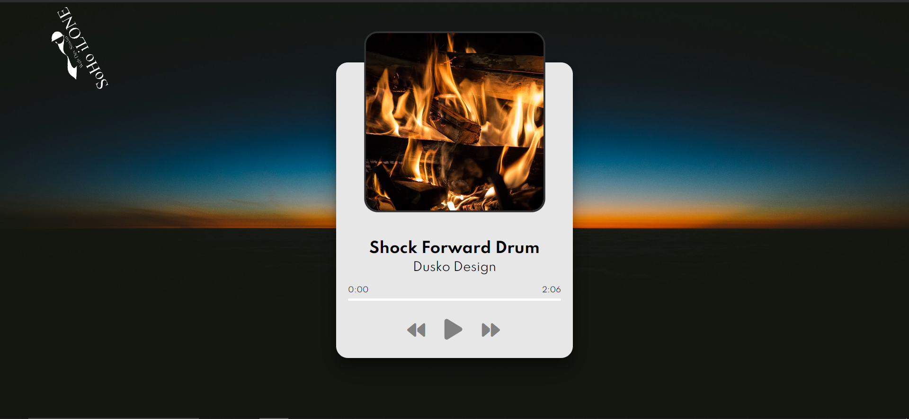

# Music Player

This is a simple and elegant music player built with HTML, CSS, and JavaScript. It provides functionalities to play, pause, skip tracks, and update progress.



## Demo

You can view a live demo of this project [here]().

## Table of Contents

- [Music Player](#music-player)
  - [Demo](#demo)
  - [Table of Contents](#table-of-contents)
  - [Features](#features)
  - [Getting Started](#getting-started)
    - [Prerequisites](#prerequisites)
    - [Installation](#installation)
  - [Usage](#usage)
  - [Running the Tests](#running-the-tests)
  - [Deployment](#deployment)
  - [Built With](#built-with)
  - [Contributing / Support](#contributing--support)
  - [Author](#author)
  - [License](#license)
  - [Acknowledgments](#acknowledgments)

## Features

- Play/Pause functionality
- Ability to skip to the next or previous track
- Progress bar to show the current position in the track
- Display of the current time and total duration of the track

## Getting Started

These instructions will get you a copy of the project up and running on your local machine for development and testing purposes.

### Prerequisites

What things you need to install the software and how to install them:

- A modern web-browser (Chrome, Firefox, Safari, Edge)

### Installation

1. Clone this repository.
2. Navigate to the project directory.
3. Open `index.html` in your browser.

## Usage

1. Use the play/pause button to play or pause the track.
2. Use the next and previous buttons to change tracks.

## Running the Tests

This project uses [Jest](https://jestjs.io/) for automated testing. Here's how you can run the tests:

1. First, ensure you have Node.js and npm installed on your system. If not, you can download and install them from the [official Node.js website](https://nodejs.org/).

2. Navigate to the project directory in your terminal.

3. If you haven't already, install the project dependencies using npm:

    ```bash
    npm install
    ```

4. Run the tests:

    ```bash
    npm test
    ```

This will start Jest and run all test files (`*.test.js`) in the project. If the tests are successful, you will see an output indicating the number of passed tests. If some tests fail, Jest will provide an error message explaining the reason for the failure.

## Deployment

Add additional notes about how to deploy this on a live system.

## Built With

- [HTML](https://developer.mozilla.org/en-US/docs/Web/HTML) - The markup language used
- [CSS](https://developer.mozilla.org/en-US/docs/Web/CSS) - The style sheet language used
- [JavaScript](https://developer.mozilla.org/en-US/docs/Web/JavaScript) - The programming language used

## Contributing / Support

-Contributions are welcome! If you find any issues or have suggestions for improvements, feel free to open an issue or create a pull request.
-If you're having any problem, please raise an issue on GitHub and the maintainers will help you out.


## Author

This amasing project is maintained by Duško Vokić. You can reach out to me on [GitHub](https://github.com/D-vokic?tab=repositories) or [LinkedIn](https://www.linkedin.com/in/du%C5%A1ko-voki%C4%87-0337a2106) for any queries or suggestions.


## License

This project is licensed under the MIT License - see the [LICENSE.md](LICENSE.md) file for details

## Acknowledgments

- [Font Awesome](https://fontawesome.com/) - Used for icons.
- [Unsplash](https://unsplash.com/) - Source of album cover images.
- [GitHub Pages](https://pages.github.com/) - Hosting the project website.